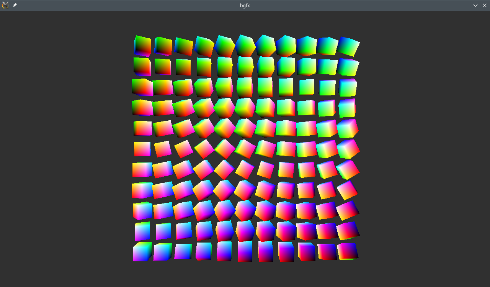

# bgfx-SDL2

A simple example of using bgfx in SDL2 that actually draws something.



Derived from the following:

https://stackoverflow.com/questions/55487168/having-trouble-initializing-bgfx-with-an-sdl2-window

https://github.com/bkaradzic/bgfx/blob/master/examples/01-cubes/cubes.cpp

```
make -f Makefile.shaders # this is how fs_cubes.bin.h and vs_cubes.bin.h were generated
```

Tested in x64 Linux on RX 460 with Vulkan and OpenGL. It should work in Windows as well.

Please keep in mind that I don't have much experience with bgfx, which means that he example could probably be improved.
